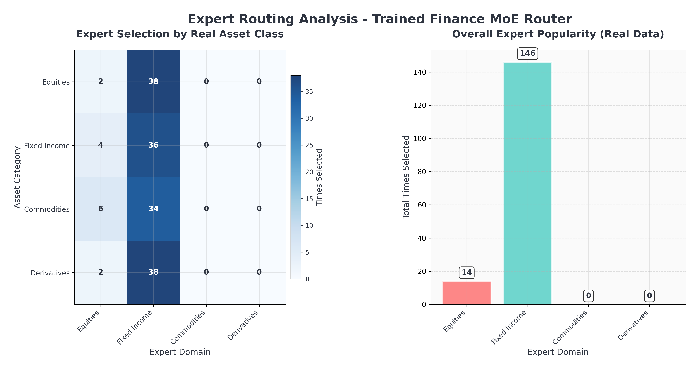

# Finance Mixture of Experts (MoE) Kernel

## Overview

This project implements a high-performance Finance Mixture of Experts (MoE) system that combines Mojo compute kernels with PyTorch models. The system intelligently routes financial data to specialized expert domains based on asset characteristics and market conditions, providing optimal processing for different types of financial instruments.

I am a complete beginner in Mojo, but I have great interest in finance and machine learning. This project serves as a practical introduction to Mojo's capabilities, particularly in the context of financial data processing.



## Architecture

### Core Components

1. **Mojo Kernel (`kernels/finance_moe_kernels.mojo`)**
   - High-performance finance router implementation
   - Custom Mojo kernel registered as `finance_router`
   - Handles asset classification into 4 domains: Equities, Fixed Income, Commodities, Derivatives
   - Uses sophisticated volatility-based routing with market condition analysis

2. **PyTorch Model (`model.py`)**
   - `FinanceMoEModel` class wraps the Mojo kernel
   - Integrates with MAX CustomOpLibrary for Mojo kernel execution
   - Includes expert simulation and gradient computation for training
   - Supports both CPU and GPU execution via pixi environments

3. **Demo Application (`demo.py`)**
   - Real-time financial data fetching via Yahoo Finance API
   - Comprehensive visualization system using matplotlib
   - Market condition analysis and routing quality assessment

### Technical Specifications

- **Hidden Size**: 16 features (configurable via `HIDDEN_SIZE` alias)
- **Domain Count**: 4 financial domains (configurable via `NUM_DOMAINS` alias)
- **Routing Logic**: Multi-stage decision tree with volatility ranges:
  - **Equities**: 1.5-4% volatility
  - **Fixed Income**: <0.5% volatility
  - **Commodities**: 1-2.5% volatility
  - **FX**: 0.5-1.3% volatility
  - **Derivatives**: >3% volatility
  - **Credit**: 0.2-0.8% volatility

## Setup Instructions

### Prerequisites

- **Pixi**: Package manager for environment management
- **CUDA 12.0** (for GPU environments)
- **Modular Platform**: Required for Mojo runtime and MAX framework

### Installation

1. **Install Pixi** (if not already installed):
   ```bash
   curl -fsSL https://pixi.sh/install.sh | bash
   ```

2. **Clone and setup the project**:
   ```bash
   git clone https://github.com/Verdenroz/finance-moe-kernel.git
   cd finance-moe-kernel
   pixi install
   ```

### Environment Configuration

The project uses pixi with multiple environments defined in `pixi.toml`:

- **`default` (GPU)**: Uses CUDA 12.0 with PyTorch GPU support
- **`cpu`**: CPU-only environment with PyTorch CPU
- **`gpu`**: Explicit GPU environment (same as default)

### GPU Limitations

⚠️ **Important GPU Requirements:**

- **CUDA 12.0** is required for GPU environments
- **NVIDIA GPU** with compute capability 6.0 or higher
- **Minimum 4GB GPU memory** recommended for typical workloads
- GPU environments will **fallback to CPU** if CUDA is not available

**Compatibility Notes:**
- AMD GPUs are not currently supported
- macOS GPU acceleration uses Metal Performance Shaders (limited support)
- Windows environments are not officially supported

## Usage

### Model Testing

```bash
# Test model with synthetic data
pixi run -e gpu python model.py
```

### Running the Demo

```bash
#  Force GPU environment - recommended for best performance
pixi run -e gpu python demo.py
```

### Environment Management

```bash
# Activate pixi shell
pixi shell

# Switch to CPU environment
pixi shell --environment cpu

# List available tasks
pixi task list
```

## Key Dependencies

- **Modular**: Mojo runtime and MAX framework
- **PyTorch**: Model implementation and tensor operations
- **matplotlib**: Visualization system
- **yfinance**: Real-time financial data fetching
- **scikit-learn**: Data preprocessing (PCA)
- **pandas/numpy**: Data manipulation

## Performance Features

### Mojo Kernel Optimizations
- Vectorized operations using SIMD instructions
- Stack allocation for intermediate calculations
- Numerical stability measures (clipping, temperature scaling)
- Hardware-specific optimizations

### PyTorch Integration
- Custom operation library loading via `CustomOpLibrary`
- Straight-through estimator for gradient computation
- GPU acceleration through CUDA backend
- Memory-efficient processing pipelines

## Output and Visualizations

The demo generates 4 comprehensive matplotlib visualizations:

1. **Expert Routing Analysis**: Heatmap of expert selection patterns
2. **Market Conditions**: Scatter plots of volatility vs returns
3. **Time Series Analysis**: Model confidence and volatility over time
4. **Performance Analysis**: Asset performance vs expert preferences

Files are saved as: `finance_moe_*.png`

## Development

### File Structure

```
finance-moe-kernel/
├── kernels/                    # Mojo kernel implementations
│   ├── __init__.mojo          # Package initialization
│   └── finance_moe_kernels.mojo # Main kernel implementation
├── model.py                   # PyTorch model wrapper
├── demo.py                    # Real-time demonstration
├── pixi.toml                  # Environment configuration
└── README.md                  # This file
```

### Testing and Validation

The system includes comprehensive routing quality analysis:
- Asset-specific data generation
- Multi-run statistical validation
- Feature analysis matching kernel logic
- Confidence scoring and accuracy metrics

## Challenges

### Real-World Data Performance Gap

The model faces significant challenges when processing real-world financial data due to training on idealized synthetic datasets:

- **Synthetic vs. Reality**: The model is trained on clean, well-distributed synthetic data with predictable volatility patterns and clear domain boundaries
- **Market Noise**: Real financial markets contain noise, outliers, and edge cases that don't match the synthetic training distribution
- **Domain Overlap**: Actual financial instruments often exhibit characteristics spanning multiple domains (e.g., commodity-linked bonds, equity derivatives)
- **Market Regime Changes**: Real markets undergo structural shifts that synthetic data cannot fully capture
- **Data Quality Issues**: Missing data, reporting delays, and inconsistent formatting in real-world feeds

### Specific Performance Issues

- **Misclassification**: Assets may be routed to suboptimal experts due to real-world complexity
- **Confidence Degradation**: Model confidence scores drop significantly with real data compared to synthetic benchmarks
- **Temporal Drift**: Performance degrades over time as market conditions diverge from training assumptions
- **Feature Distribution Mismatch**: Real-world feature distributions often fall outside synthetic training ranges
